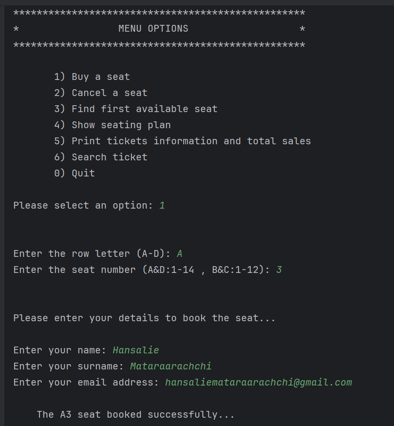
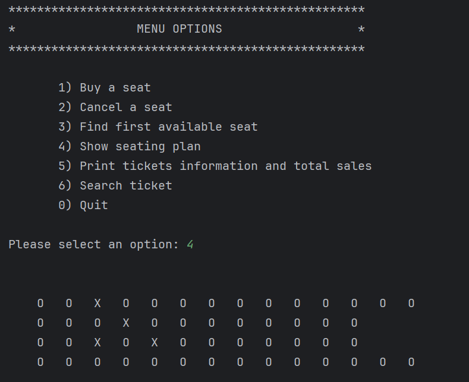

# Airline Seat Reservation System

A Java-based console application for managing airplane seat reservations, ticket purchases, and passenger information.

## Features

- **Buy seats**: Reserve seats for passengers with personal information
- **Cancel reservations**: Free up previously booked seats
- **Find available seats**: Quickly locate the first available seat
- **View seating plan**: See a visual representation of all available and occupied seats
- **Ticket information**: View detailed ticket information and total sales
- **Search tickets**: Find ticket information by seat number



<br/>



## Getting Started

### Prerequisites
- Java Development Kit (JDK) 8 or higher
- Any text editor or IDE (e.g., IntelliJ IDEA, Eclipse, VSCode)

### Installation

1. Clone the repository:
   ```bash
   git clone https://github.com/hansalie/airline-reservation-system.git
   ```

2. Navigate to the project directory:
   ```bash
   cd airline-reservation-system
   ```

3. Compile the Java files:
   ```bash
   javac PlaneManagement.java Person.java Ticket.java
   ```

4. Run the application:
   ```bash
   java PlaneManagement
   ```

## Usage

The application offers a menu-driven interface with the following options:

1. **Buy a seat**: Purchase a seat by selecting a row (A-D) and seat number
2. **Cancel a seat**: Free up a previously booked seat
3. **Find first available seat**: Locate the first available seat in the plane
4. **Show seating plan**: Display the current seating arrangement
5. **Print tickets information**: View all sold tickets and total sales
6. **Search ticket**: Find detailed information about a specific ticket
0. **Quit**: Exit the application

## Project Structure

- `PlaneManagement.java` - Main application class with the menu system
- `Person.java` - Class to manage passenger information
- `Ticket.java` - Class to handle ticket details and file operations

## Data Storage

When a seat is reserved, ticket information is saved in a text file named after the seat (e.g., A1.txt), containing:
- Seat row and number
- Ticket price
- Passenger name, surname, and email address

